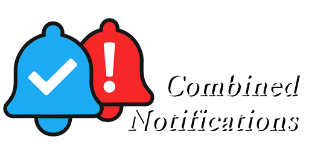
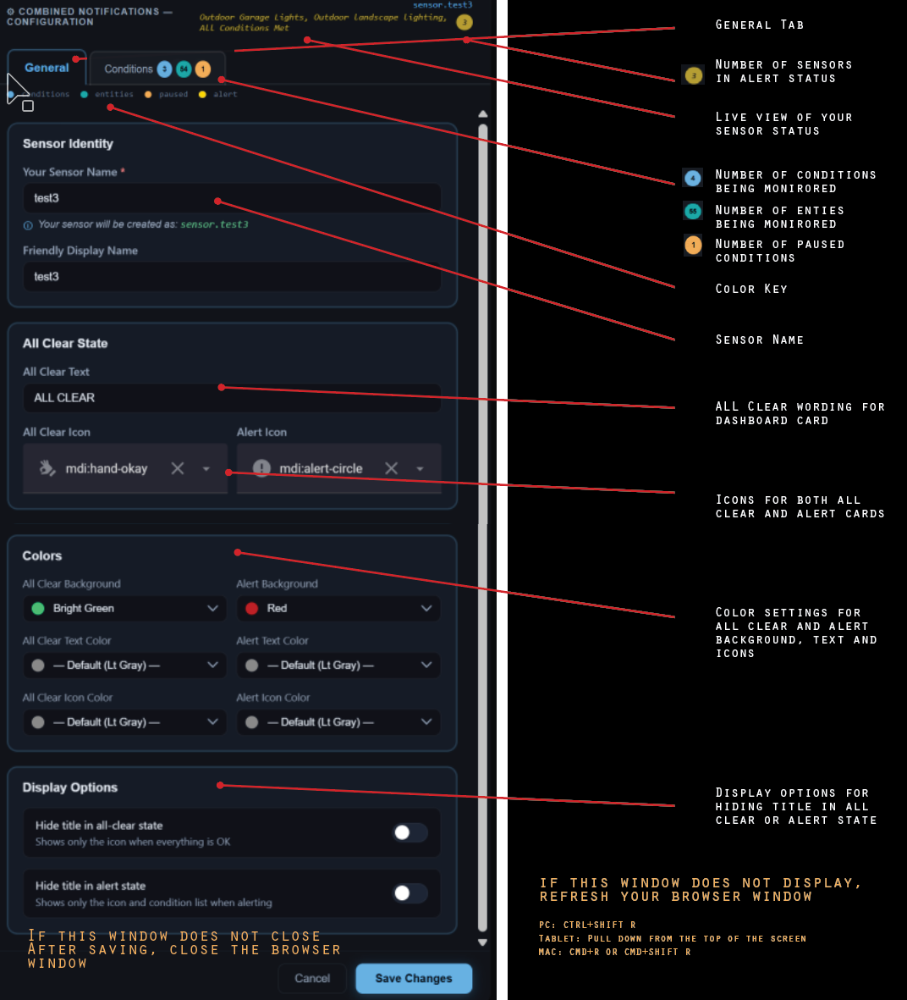
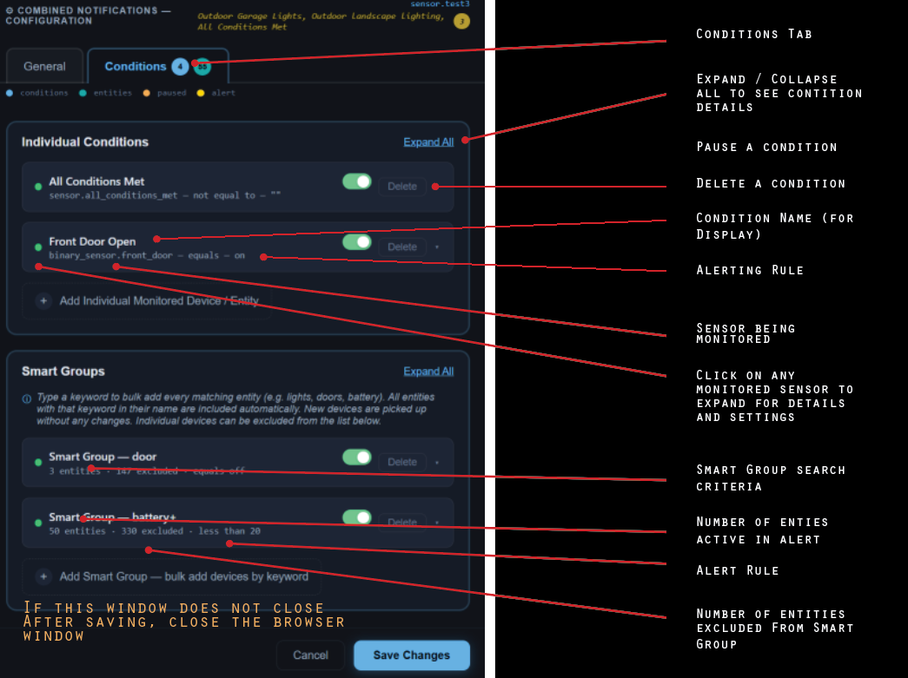
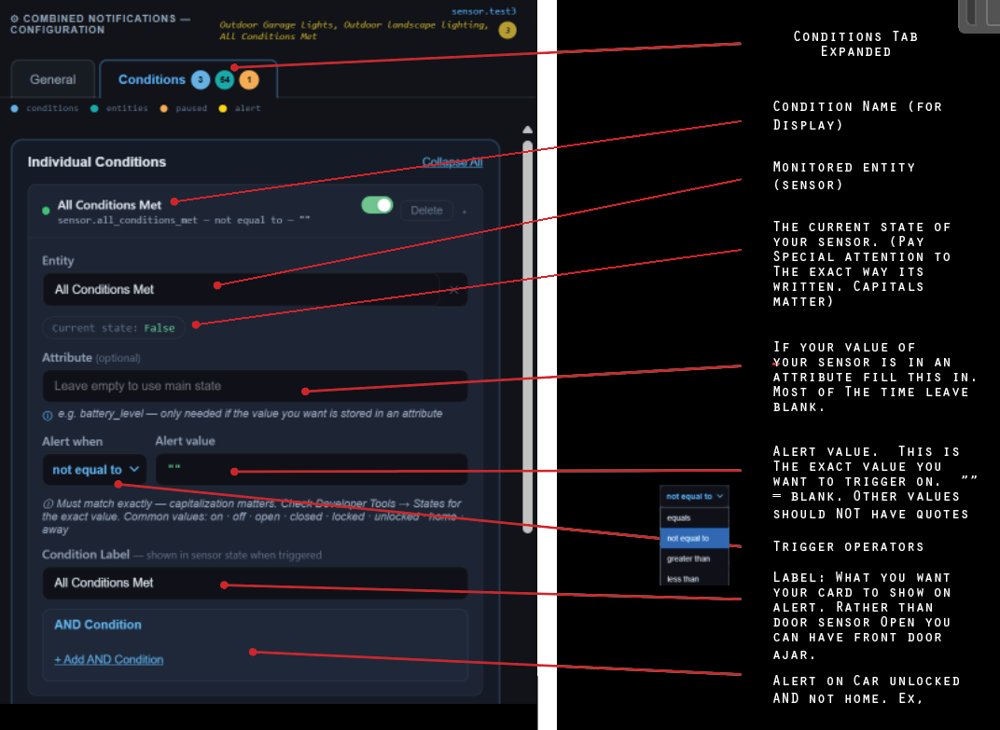
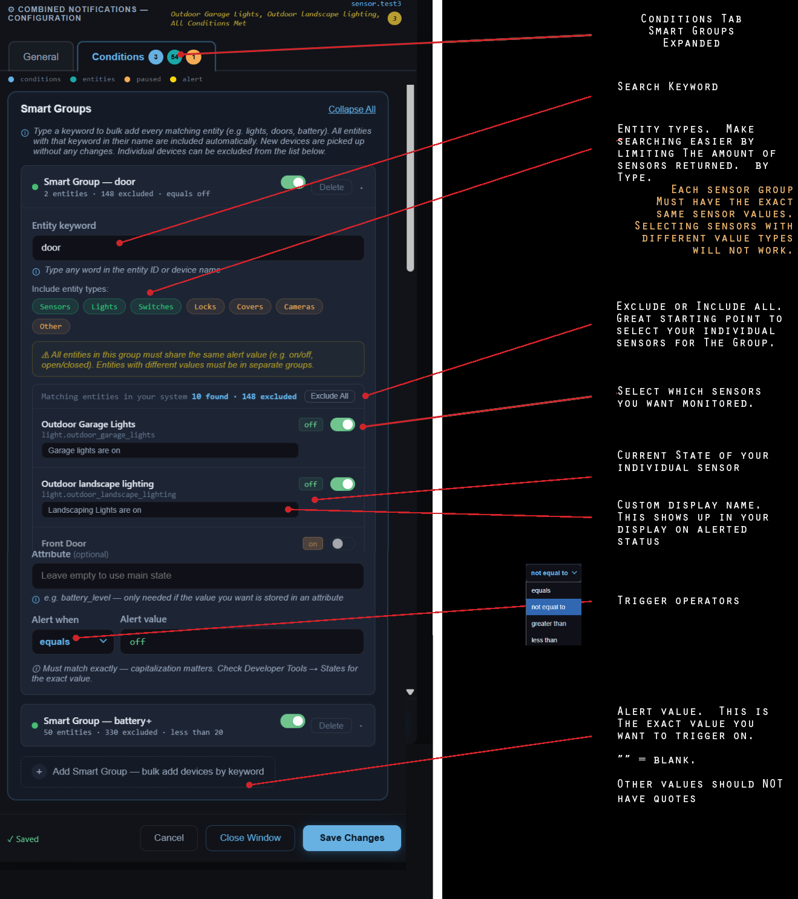
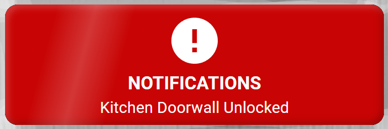

# Combined Notifications for Home Assistant — v5



[](media/demo.gif)

**Monitor and group multiple entity conditions — all on ONE CARD. No YAML editing required.**

Hundreds of conditions can be monitored with no slowdown or lagging in your frontend dashboard.

Combined Notifications monitors the entities you choose and alerts you when something needs attention — with a count of exactly how many are at fault.

- 3 lights left on: **Bathroom Light, Kitchen Light, Garage Light** — count: 3
- Door left unlocked: **Kitchen Doorwall Unlocked** — count: 1
- Battery critical: **Back Door Sensor 12%** — count: 1

No entity IDs. Just the **custom names you** gave your devices. All on **one card**.

---

## 📋 Table of Contents

- [Features and What's New in Version 5](#-features-and-whats-new-in-version-5)
- [What's New in Version 5](#-features-and-whats-new-in-version-5)
- [Upgrading from v4](#-upgrading-from-v4-to-v5)
- [Installation](#-installation)
- [Setup](#️-setup)
- [Configuration Panel](#️-configuration-panel)
  - [General Tab](#general-tab)
  - [Conditions Tab](#conditions-tab--overview)
  - [Individual Conditions](#individual-conditions--expanded)
  - [Smart Groups](#smart-groups--expanded)
- [Sensor Behavior](#-sensor-behavior)
- [Alert Count](#-alert-count)
- [Dashboard Cards](#️-dashboard-cards)
  - [1. Basic — Hardcoded Colors](#1-basic--hardcoded-colors)
  - [2. Basic — Integration Colors](#2-basic--integration-colors)
  - [3. Advanced — Integration Colors with card-mod](#3-advanced--integration-colors-with-card-mod-recommended)
- [Alert Ticker Card Pairing](#-alert-ticker-card-pairing)
- [Combined Notifications vs Alert Ticker](#-combined-notifications-vs-alert-ticker)
- [A Note from the Developer](#-a-note-from-the-developer)
- [Removal](#-removal)
- [License](#-license)

---

## ✅ Features and What's New in Version 5

**Version 5 — Rebuilt from the ground up with all new features and functions**

- Monitor unlimited entities with flexible alert conditions
- Individual conditions — monitor specific entities one at a time
- Smart Groups — bulk-add entities by keyword (e.g. all `door`, all `battery`, all `light`)
- "AND" conditions — alert only when multiple requirements are met simultaneously
- Pause conditions without deleting them
- Automatic Alert COUNT sensor created alongside each notification sensor
- Fully configured from the UI — no YAML required
- Each sensor outputs a live list of active alert names, or blank when all clear
- All new configuration UI — everything is visual, **no YAML required** 🆕
- **Live Sensor State** shown right in the panel — no more hunting Developer Tools to figure out if your sensor says `open`, `Open`, `true`, or `1` 🆕
- Smart Groups — type a keyword and bulk add every matching entity 🆕
- "AND" conditions — is the car unlocked AND not in the garage? Is the back door open AND nobody is home? Now you can get an alert when both conditions meet your alert needs 🆕
- Pause conditions without deleting them 🆕
- **Alert Count** sensor created automatically alongside every sensor you make 🆕
- Still ONE sensor, ONE card 🆕

---

## ⬆️ Upgrading from v4 to v5

Moving from v4 to v5 should be seamless. Your existing sensors should carry over to the new version without any issues.

Use caution before upgrading. Going back to v4 will not be easy. This upgrade is not downgradable without rebuilding all your sensors from scratch. Make a backup of your Home Assistant configuration before updating, just in case you want to go back.

---

## 📦 Installation

1. Open **HACS** in Home Assistant
2. Go to **Integrations**
3. Search for **Combined Notifications**
4. Click **Download**
5. Restart Home Assistant
6. Go to **Settings → Devices & Services → Add Integration** and search for **Combined Notifications**

---

## ⚙️ Setup

1. Go to **Settings → Devices & Services → Combined Notifications → Configure**
2. Define your sensor name
3. Add conditions
4. Customize appearance and behavior
5. Save

To modify settings later — add/delete entities, change triggers, update colors/icons — go to **Settings → Devices & Services → Combined Notifications → Configure**. No YAML or restart required.

> Sensor names must use lowercase letters and underscores only — no spaces, no capitals.
> Example: `sensor.YOUR_SENSOR_NAME`

### Make Your Dashboard Card

a. Go to your dashboard and add a manual card

b. Copy the YAML of the card type you like from below

c. Paste it into the manual card box

d. Change the sensor name. That's it — Enjoy!

---

## 🖥️ Configuration Panel

### General Tab



See the image above for all settings. If the panel does not display after selecting Configure, refresh your browser:
**PC:** `Ctrl+Shift+R` · **Tablet:** Pull down from top · **Mac:** `Cmd+R` or `Cmd+Shift+R`

If the window does not close after saving, close the browser window.

---

### Conditions Tab — Overview

The Conditions tab shows all monitored conditions at a glance. Badge colors indicate conditions, entities, paused, and alert counts — see image below.



---

### Individual Conditions — Expanded

Click any condition to expand it and configure the entity, alert rule, label, and optional AND condition.



Look at the configuration panel — it shows the current state of your entity right there. That should give you a strong indication of exactly what value to use.

Alert Value: `""` = blank. Other values do NOT use quotes.

---

### Smart Groups — Expanded

Smart Groups bulk-add every entity matching a keyword. Run the configuration panel after adding new devices to include them in an existing group.



Each entity in a Smart Group has a **Custom Label** field. Use this to give each entity a friendly name that displays on your card when it alerts. Instead of seeing `binary_sensor.garage_door_contact`, your card will show **Garage Door Open** — whatever you type in the label field.

All entities in a Smart Group must share the same alert value (e.g. all `on/off` or all `open/closed`). Entities with different value types must be in separate groups.

Use **Exclude All** as a starting point, then toggle on only the entities you want monitored.

---

## 🔍 Sensor Behavior

The sensor reports a comma-separated list of unmet condition labels when alerting, or your all-clear text when everything is fine. It also exposes styling attributes that cards can read directly.

#### All Clear

```yaml
state: "ALL CLEAR"
attributes:
  icon: mdi:check-circle
  color: green
  text_color: white
  icon_color: gray
```

#### Alert

```yaml
state: "Garage Open, Door Unlocked"
attributes:
  icon: mdi:alert-circle
  color: red
  text_color: black
  icon_color: yellow
```

---

## 🔢 Alert Count

For each sensor you create (e.g. `sensor.YOUR_SENSOR_NAME`), an **Alert Count** sensor is automatically generated (e.g. `sensor.YOUR_SENSOR_FAULT_COUNT`) that displays the number of active alerts as a simple number. Perfect for badges on light and entity cards.

#### Example Card with Count Badge

```yaml
type: custom:mushroom-light-card
entity: light.YOUR_LIGHT_GROUP
name: Office Lights
icon: mdi:lightbulb
icon_color: yellow
badge_icon: |
  
  mdi:numeric-{{ states('sensor.YOUR_SENSOR_FAULT_COUNT') }}
  
```

#### Example Card with All Off When Count is Zero

```yaml
type: custom:mushroom-light-card
entity: light.YOUR_LIGHT_GROUP
name: Office Lights
secondary_info: |
  
  All Off
  
icon: mdi:lightbulb
```

#### Example Card with Badge and List of Active Lights

```yaml
type: custom:mushroom-light-card
entity: light.YOUR_LIGHT_GROUP
name: Office Lights
secondary_info: |
  {{ state_attr('sensor.YOUR_SENSOR_NAME', 'unmet_conditions')|join(', ') if state_attr('sensor.YOUR_SENSOR_NAME', 'unmet_conditions') }}
icon: mdi:lightbulb
icon_color: yellow
badge_icon: |
  
  mdi:numeric-{{ states('sensor.YOUR_SENSOR_FAULT_COUNT') }}
  
```

---

## 🖼️ Dashboard Cards

There is a Combined Notifications Card available in HACS, but unfortunately I can't recommend it. There are other cards that are better (listed below) or you can simply use the Alert Ticker Cards if you like the styling.

Personally, I use the cards listed below. For my use, the alert ticker cards are too distracting and don't fit with the look of my dashboards. Styling is a personal decision. Pick what you like, the decision is yours.

To add any of these cards to your dashboard:

1. Edit your dashboard
2. Click **Add Card**
3. Select **Manual**
4. Paste the code
5. Change `sensor.YOUR_SENSOR_NAME` to your Combined Notifications sensor
6. Click **Save**

---

### 1. Basic Card — Hardcoded Colors (Overrides the integrated sensor styling)

Simple card with colors hardcoded directly in the YAML. Change the colors to match your dashboard. The only lines that need to change — replace `sensor.YOUR_SENSOR_NAME` with your sensor and change the color values in the yaml code to match your preferences.

```yaml
type: custom:button-card
entity: sensor.YOUR_SENSOR_NAME
name: NOTIFICATIONS
show_name: true
show_icon: true
show_state: false
styles:
  card:
    - background-color: >
        [[[ if (entity.state !== "") { return "#c80404"; } else { return
        "rgba(67, 73, 82, 1)"; } ]]]
    - border-radius: 10px
    - padding: 6px 10px 10px 10px
    - color: rgb(255, 255, 255)
    - white-space: normal
    - font-size: 20px
  name:
    - font-weight: bold
    - text-align: center
    - font-size: 23px
    - margin-top: 0
  label:
    - white-space: normal
    - display: block
    - max-width: 100%
    - padding-top: 5px
    - text-align: center
  icon:
    - color: >
        [[[ if (entity.state === "") { return "rgb(38, 141, 53)"; } else {
        return "rgb(255, 255, 255)"; } ]]]
    - width: 70px
    - height: 70px
    - margin: 5px 0
icon: >
  [[[ if (entity.state !== "") { return "mdi:alert-circle"; } else { return
  "mdi:hand-okay"; } ]]]
show_label: true
label: >
  [[[ if (entity.state !== "") { return entity.state; } else { return "All
  CLEAR"; } ]]]
tap_action:
  action: none
hold_action:
  action: none
```

---

### 2. Basic — Card that uses the Integration Colors and Icons

Pulls colors and icons directly from your Combined Notifications sensor — no hardcoded values needed. Change your colors and icons in the integration and the card updates automatically. Only one line needs to change — replace `sensor.YOUR_SENSOR_NAME` with your sensor.

```yaml
type: custom:button-card
entity: sensor.YOUR_SENSOR_NAME
name: NOTIFICATIONS
show_name: true
show_icon: true
show_state: false
styles:
  card:
    - background-color: >
        [[[ if (entity.state !== "") { return entity.attributes.color_alert; }
        else { return entity.attributes.color_clear; } ]]]
    - border-radius: 10px
    - padding: 6px 10px 10px 10px
    - color: >
        [[[ if (entity.state === "") { return entity.attributes.text_color_clear; }
        else { return entity.attributes.text_color_alert; } ]]]
    - white-space: normal
    - font-size: 20px
  name:
    - font-weight: bold
    - text-align: center
    - font-size: 23px
    - margin-top: 0
  label:
    - white-space: normal
    - display: block
    - max-width: 100%
    - padding-top: 5px
    - text-align: center
  icon:
    - color: >
        [[[ if (entity.state === "") { return entity.attributes.icon_color_clear; }
        else { return entity.attributes.icon_color_alert; } ]]]
    - width: 70px
    - height: 70px
    - margin: 5px 0
icon: >
  [[[ if (entity.state !== "") { return entity.attributes.icon_alert; } else {
  return entity.attributes.icon_clear; } ]]]
show_label: true
label: >
  [[[ if (entity.state !== "") { return entity.state; } else { return
  entity.attributes.text_all_clear; } ]]]
tap_action:
  action: none
hold_action:
  action: none
```

---

### 3. Advanced — Card with Integration Colors with card-mod(uix) and advanced styling.




This is the version I use. Requires [button-card](https://github.com/custom-cards/button-card) and [card-mod](https://github.com/thomasloven/lovelace-card-mod).(uix) The card is coded with card-mod for backward compatability. The card-mod section adds a light reflection effect for a polished appearance.

Only one line needs to change — replace `sensor.YOUR_SENSOR_NAME` with your sensor. Paste into a Manual card in your dashboard.

```yaml
type: custom:button-card
entity: sensor.home_conditions
name: NOTIFICATIONS
show_name: true
show_icon: true
show_state: false
styles:
  card:
    - background-color: >
        [[[ if (!entity.attributes.is_clear) { return
        entity.attributes.color_alert; } else { return
        entity.attributes.color_clear; } ]]]
    - border-radius: 16px !important
    - box-shadow: >
        12px 12px 24px rgba(0, 0, 0, 0.5), -4px -4px 8px rgba(255, 255, 255,
        0.1), inset -4px -4px 8px rgba(0, 0, 0, 0.2), inset 4px 4px 8px
        rgba(255, 255, 255, 0.2) !important
    - overflow: hidden !important
    - padding: 6px 10px 10px 10px !important
    - color: >
        [[[ if (!entity.attributes.is_clear) { return
        entity.attributes.text_color_alert; } else { return
        entity.attributes.text_color_clear; } ]]]
    - white-space: normal
    - position: relative !important
    - font-size: 20px
  name:
    - font-weight: bold
    - text-align: center
    - font-size: 23px
    - margin-top: 0
  label:
    - white-space: normal
    - display: block
    - max-width: 100%
    - padding-top: 5px
    - text-align: center
  icon:
    - color: >
        [[[ if (!entity.attributes.is_clear) { return
        entity.attributes.icon_color_alert; } else { return
        entity.attributes.icon_color_clear; } ]]]
    - width: 70px
    - height: 70px
    - margin: 5px 0
icon: >
  [[[ if (!entity.attributes.is_clear) { return entity.attributes.icon_alert; }
  else { return entity.attributes.icon_clear; } ]]]
show_label: true
label: >
  [[[ if (!entity.attributes.is_clear) { return entity.state; } else { return
  entity.attributes.text_all_clear; } ]]]
tap_action:
  action: none
hold_action:
  action: none
card_mod:
  style: |
    ha-card::after {
      content: '' !important;
      position: absolute !important;
      width: 100px !important;
      height: 100% !important;
      background: linear-gradient(
        to right,
        rgba(255, 255, 255, 0) 0%,
        rgba(255, 255, 255, 0.15) 50%,
        rgba(255, 255, 255, 0) 100%
      ) !important;
      transform: skewX(-15deg) translateX(50px) !important;
      top: 0 !important;
      left: -20px !important;
      z-index: 1 !important;
    }

```

---

## 🔔 Alert Ticker Card Pairing

The [Alert Ticker Card](https://github.com/djdevil/AlertTicker-Card) is a complete alert design card system with unique dashboard card styling and functions.

If you have just a few alerts to watch you can avoid Combined Notifications completely and use Alert Ticker alone. It will work well. If you have many alerts and like the Alert Ticker styling, pairing this integration with Alert Ticker cards is your best option. A marriage of Combined Notifications backend processing and sensor entities with the frontend of Alert Ticker Cards.

```yaml
type: custom:alert-ticker-card
cycle_interval: 5
show_when_clear: false
alerts:
  - entity: sensor.YOUR_SENSOR_NAME
    operator: "!="
    state: ""
    message: Active Alerts
    secondary_entity: sensor.YOUR_SENSOR_NAME
    priority: 1
    theme: emergency
    icon: 🚨
```

The `secondary_entity` field displays the live sensor state — your active condition list — as a second line below the message.

---

## ⚡ Combined Notifications vs Alert Ticker

This integration creates actual Home Assistant sensors that keep track of which of your entities are alerting and what they are. Because it's a sensor, you can do anything with it:

1. Send a text when the garage is left open
2. Flash a light when a door is unlocked
3. Make an announcement when a window is open
4. Show it on any dashboard card styled exactly how you want

Alert Ticker is a great addition to HA. It has a ton of card styles. Because Combined Notifications is a sensor, you can easily use it with Alert Ticker cards if you wish. But here's why Combined Notifications is different and has a real advantage:

1. All calculations happen in the background, not in your Lovelace frontend
2. Monitor 100+ entities with zero performance hit. Try that with Alert Ticker!
3. Too many dashboard cards doing this frontend work can make your dashboard nearly unusable. I know, I had over 100 conditional cards before building this. My dashboard was almost unusably slow. That was the reason this integration exists
4. Sensor state survives browser refreshes and dashboard reloads without a performance hit
5. Home Assistant history and logging are handled automatically

---

## 💬 A Note from the Developer

This integration is free and will always be free. If you find it useful, skip the coffee and give $5 to someone who needs it.

---

## 🗑️ Removal

- Go to **Settings → Devices & Services**
- Find **Combined Notifications** and click **Delete**
- The created sensors will be removed automatically

---

## 📄 License

MIT — see [LICENSE](LICENSE.md) for details.
